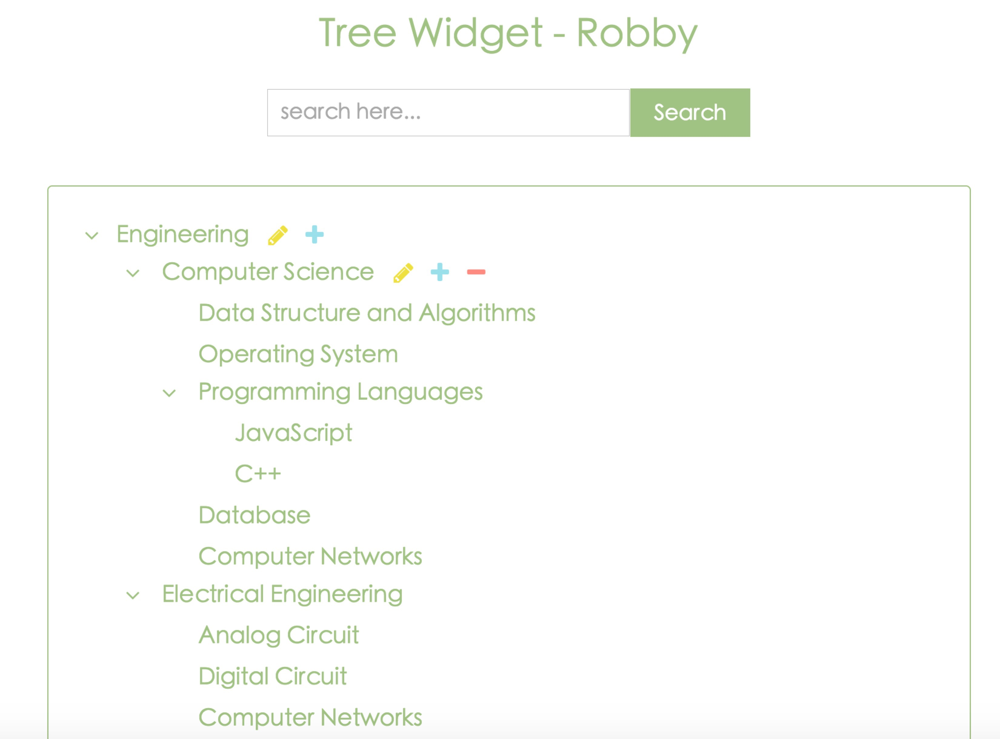

# Tree-Widget
Simple UI to learn OOP 
[Demo: Tree Widget](https://robbyvan.github.io/Tree-Widget/index.html) 

## Syntax
   `var UIInstance = new TreeNode(nodeConfig, outputId);` 
   `@param {Object} nodeConfig` 
   `@param {String} outputId`  
  

## Example
   `const root = new TreeNode({nodeContent: 'Countries'}, 'tree-panel');` 

